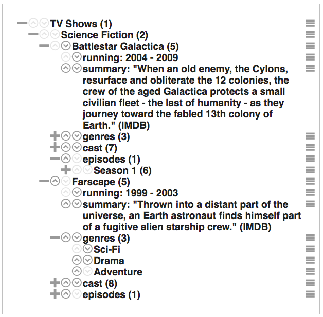

# Groot

A UI tree for working with nested content.



## Usage

### Installation

Install groot with npm.

```
$ npm install groot
```

Import the `Groot` constructor into your own module.

```
import { Groot } from 'groot';
```

### Creating your tree

Create a tree by iterating over some data and transforming it into instances of `Groot.Leaf`.

```js
const rootLeaf = new Groot.Leaf('root leaf');
let child = rootLeaf.branch('child leaf 1');
child.branch('child leaf 1.1');
child.branch('child leaf 1.2');
rootLeaf.branch('child leaf 2');
child = rootLeaf.branch('child leaf 3');
child.branch('child leaf 3.1');
// etc.

const containerElement = document.querySelector('#some-container');
const tree = new Groot(containerElement, rootLeaf);
rootLeaf.expand(true);
tree.render();
```

See [src/demo.js](https://github.com/enotes/groot/blob/master/src/demo.js) for a more complete example.

### Adding custom meta-data

Leafs can contain custom meta-data in the form of attributes.

```js
const leaf = tree.branch('child leaf');
leaf.setAttribute('myCustomID', 123);
```

Setting custom meta-data on a leaf allows you to dereference the leaf against your application's own data. Custom meta-data also plays a part in Groot events, discussed below.

### Listening for events

Groot raises events for nearly every tree operation. Some of these will require you to commit to, or cancel an operation before it completes.

| Event           | Description                                          | Async? | Multisource? | Special Properties                                                                                                                                     |
| --------------- | ---------------------------------------------------- | ------ | ------------ | ------------------------------------------------------------------------------------------------------------------------------------------------------ |
| rendering       | the tree is about to be rendered in the DOM          | no     | no           |                                                                                                                                                        |
| rendered        | the tree has been rendered in the DOM                | no     | no           |                                                                                                                                                        |
| leaf.moving     | a leaf is moving                                     | yes    | yes          | direction=up,down,first,last,to,parent,before,after ,                                                                                                  |
| leaf.moved      | a leaf has moved                                     | no     | yes          | see: leaf.moving                                                                                                                                       |
| leaf.clicking   | a leaf is being clicked on                           | no     | no           | isRightClick={Boolean}                                                                                                                                 |
| leaf.clicked    | a leaf has been clicked on                           | no     | no           | see: leaf.clicking                                                                                                                                     |
| leaf.dragging   | a leaf is starting to be dragged                     | no     | no           |                                                                                                                                                        |
| leaf.dragged    | a leaf has been dragged                              | no     | no           |                                                                                                                                                        |
| leaf.dropping   | a leaf is starting to be dropped onto another leaf   | no     | yes          |                                                                                                                                                        |
| leaf.dropped    | a leaf has been dropped onto another leaf            | no     | yes          |                                                                                                                                                        |
| leaf.renaming   | a leaf is about to be renamed                        | yes    | no           | isNew={Boolean}, label={String}                                                                                                                        |
| leaf.renamed    | a leaf has been renamed                              | no     | no           | see: leaf.renaming                                                                                                                                     |
| leaf.unnamed    | a leaf has been unnamed (pending rename is canceled) | no     | no           | see: leaf.renaming                                                                                                                                     |
| leaf.expanding  | a leaf is about to expand                            | no     | no           | deep={Boolean}                                                                                                                                         |
| leaf.expanded   | a leaf has expanded                                  | no     | no           | see: leaf.expanding                                                                                                                                    |
| leaf.collapsing | a leaf is about to collapse                          | no     | no           | deep={Boolean}                                                                                                                                         |
| leaf.collapsed  | a leaf has collapsed                                 | no     | no           | see: leaf.collapsing                                                                                                                                   |
| leaf.deleting   | a leaf is about to be deleted                        | yes    | no           |                                                                                                                                                        |
| leaf.deleted    | a leaf has been deleted                              | no     | no           |                                                                                                                                                        |
| leaf.creating   | a leaf is about to be created                        | no     | no           | projectedPosition={Number}                                                                                                                             |
| leaf.created    | a leaf has been created                              | no     | no           | see: leaf.creating                                                                                                                                     |
| leaf.pruning    | a leaf is about to be pruned                         | no     | no           |                                                                                                                                                        |
| leaf.pruned     | a leaf has been pruned                               | no     | no           |                                                                                                                                                        |
| leaf.activating | a leaf is about to be activated                      | no     | no           | deep={Boolean}                                                                                                                                         |
| leaf.activated  | a leaf has been activated                            | no     | no           | see: leaf.activating                                                                                                                                   |
| leaf.disabling  | a leaf is about to be disabled                       | no     | no           | deep={Boolean}                                                                                                                                         |
| leaf.disabled   | a leaf has been disabled                             | no     | no           | see: leaf.disabling                                                                                                                                    |
| menu.clicking   | a menu item is about to be clicked                   | no     | no           | action=create,rename,delete,move-to,move-up,move-down,move-first,move-last,move-before,move-after,make-parent,activate-children,disable-children,close |
| menu.clicked    | a menu item has been clicked                         | no     | no           | see: menu.clicking                                                                                                                                     |
| menu.showing    | the menu is about to show                            | no     | no           |                                                                                                                                                        |
| menu.shown      | the menu has been shown                              | no     | no           | (menu options)                                                                                                                                         |
| menu.hiding     | the menu is about to be hidden                       | no     | no           |                                                                                                                                                        |
| menu.hidden     | the menu has been hidden                             | no     | no           | (menu options)                                                                                                                                         |

For convenience, event names may be referenced by using the `Groot.EVENTS` object. For example:

```js
Groot.EVENTS.RENDERED === 'rendered'
Groot.EVENTS.LEAF.DELETING === 'leaf.deleating'
Groot.EVENTS.MENU.HIDDEN === 'menu.hidden'
// etc.
```

Subscriptions to Groot events are established by calling its `on()` method with a callback.

```js
tree.on(Groot.EVENTS.LEAF.MOVING, (eventArgs) => {
    // handle the event
});
```

All event callbacks will receive an `eventArgs` object. This will contain contextual information about the event. If a single node is involved, the `eventArgs` object will contain a `source` property with information about that node. If two nodes are involved (e.g.., drag-n-drop, or "Assign parent"), the `eventArgs` object will contain both `source` and `target` properties with information about the originator of the action (`source`) and the receiver of the action (`target`). These properties will also contain all of the custom meta-data added to their corresponding leafs.

Synchronous events cannot be stopped, but asynchronous events *can* be stopped. An asynchronous `eventArgs` object will contain two methods, `commit()` and `cancel()`, either of which must be called to finish the asynchronous operation. For example:

```js
tree.on(Groot.EVENTS.LEAF.DELETING, (eventArgs) => {
    api.delete(eventArgs.source.myCustomID).then(() => {
        // success :)
        eventArgs.commit();
    }, (err) => {
        // failure :(
        eventArgs.cancel();
    });
});
```


## TODO

- polish demo
- documentation
- docblock comments